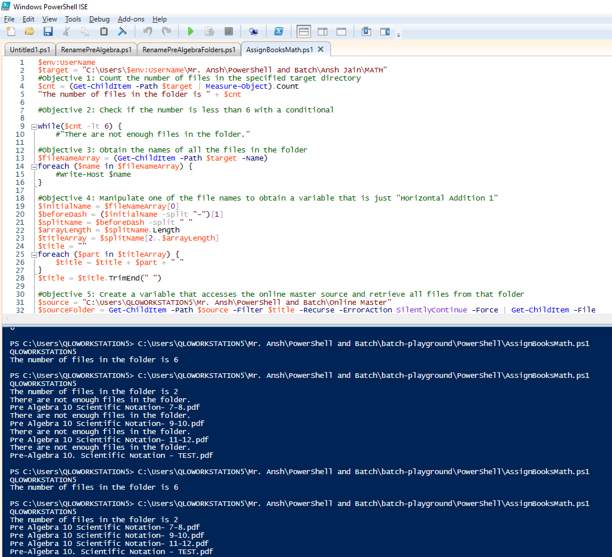

# Batch Playground

This repository has two purposes. The first is to allow me to simply practice scripting in Batch and Windows PowerShell, both concepts that are new to me. The second is for the overall goal of attempting to automatically assign homework to Quest Learning online students. Students receive homework through the transfer and renaming of PDF files, so these scripts are designed to facilitate that process by automatically selecting the next book, renaming it with the appropriate day and date, and moving the item to the student's folder, with only the items that are already in there as input. 

	

## Built With

  * [PowerShell ISE](https://docs.microsoft.com/en-us/powershell/scripting/core-powershell/ise/introducing-the-windows-powershell-ise?view=powershell-6) - Used for creating and editing .ps1 files
  * [Cmd](https://docs.microsoft.com/en-us/windows-server/administration/windows-commands/cmd) - Running batch files
  * [Sublime Text 3](https://www.sublimetext.com/) - Universal Text Editor

## Authors

* **Ansh Jain** - *Initial work* - [Gamebot3](https://github.com/Gamebot3)

## License

This project is licensed under the MIT License - see the [LICENSE.md](LICENSE.md) file for details
